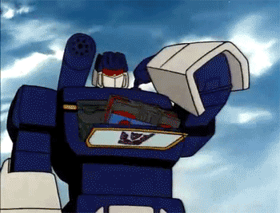

# Eject Drives for Elgato Stream Deck (macOS)

A simple macOS script to eject multiple external drives with a single Stream Deck button press.

<figure>
  
  <figcaption style="font-size: 0.85em;">Laserbeak, Ravage, Rumble, Frenzy, Buzzsaw, Ratbat--Eject, Transform & DESTROY!</figcaption>
</figure>

## Features

- Eject multiple external drives by name
- macOS notifications on success or failure
- Stream Deck integration (zero-click eject before you leave)
- Customizable drive list

## Setup

### 1. Configure Drive Names

Edit `eject-drives.sh` and update the `DRIVES` array with your external drive names:

```zsh
DRIVES=("Media" "Archives")
```

Get your drive names from:
```bash
ls /Volumes
```

### 2. Make Executable

```bash
chmod +x eject-drives.sh
```

### 3. Build the Stream Deck Launcher

If you want a Stream Deck button (recommended), build the macOS app launcher:

```bash
make install
```

This creates `~/Applications/EjectDrives.app` that you can wire to Stream Deck.

Or manually using `osacompile`:
```bash
osacompile -o ~/Applications/EjectDrives.app -e 'do shell script "/path/to/eject-drives.sh > /tmp/eject.log 2>&1" with administrator privileges'
```

**Note:** The first run will prompt for your admin password. After that, you can set up passwordless ejects (see step 4).

### 4. Optional: Passwordless Ejects (Recommended)

To skip the password prompt every time, allow your user to run `diskutil eject` without a password:

```bash
echo "$(whoami) ALL=(ALL) NOPASSWD: /usr/sbin/diskutil eject *" | sudo tee /etc/sudoers.d/diskutil-eject > /dev/null
```

Enter your password when prompted. After this, the Stream Deck button will eject drives instantly with zero prompts.

Or use `make setup-sudoers`:
```bash
make setup-sudoers
```

## Usage

### From Terminal

```bash
./eject-drives.sh
```

### From Stream Deck

1. Open Stream Deck software
2. Drag **System** → **Open** to a button
3. Click the button → browse to `~/Applications/EjectDrives.app`
4. Press the button to eject all configured drives

## Example: Multiple Drives

```zsh
DRIVES=("Media" "Archives" "Backup" "External SSD")
```

All four drives will eject when you press the button (or run the script). Failed ejections will show in the notification.

## Customization

Edit `eject-drives.sh`:
- Change `DRIVES=()` to match your drive names
- Adjust the notification title in the `osascript` calls
- Add additional logic as needed

## License

MIT

## Author

Joseph Louthan
